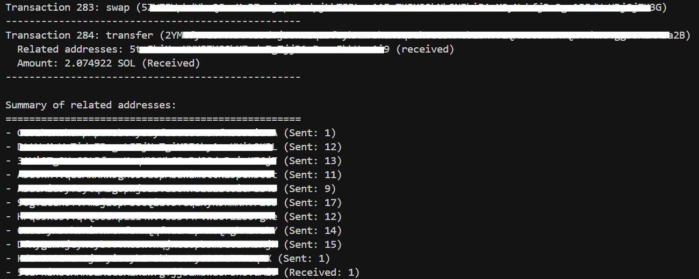

# Solana Related Wallets Analyzer

A command-line tool that analyzes Solana wallet transactions to identify related addresses, track sent/received patterns, categorize transaction types, and provide detailed summaries with configurable history depth.



## Prerequisites

- Node.js installed
- NPM or Yarn package manager
- An Alchemy Solana API key

## Setup

Clone this repository or download the source code:

```
git clone https://github.com/tjkeat123/solana-tools.git
cd solana-tools/solana-wallet-analyzer
```

Install dependencies:

```
npm install
```

Create a `.env` file in the project root with your Alchemy API key:

```
ALCHEMY_API_KEY=your_alchemy_api_key_here
```

## Usage

Run the tool with a Solana wallet address:

```
node get_related_wallets.js <wallet_address> [transaction_limit] [--log]
```

### Parameters:

- `wallet_address`: The Solana wallet address to analyze (required)
- `transaction_limit`: Number of transactions to analyze (optional, default: 10, max: 1000)
- `--log`: Flag to enable logging of transaction data to a JSON file (optional)

### Examples:

Analyze 10 transactions (default):
```
node get_related_wallets.js YourWalletAddressHere
```

Analyze 50 transactions:
```
node get_related_wallets.js YourWalletAddressHere 50
```

Analyze 25 transactions and log detailed data:
```
node get_related_wallets.js YourWalletAddressHere 25 --log
```

The following is an example of the output:

```
$ node get_related_wallets.js YourWalletAddressHere 1200
Notice: Transaction limit capped to 1000 (you requested 1200)

Analyzing transactions for address: YourWalletAddressHere
Transaction limit: 1000
==================================================
Found 284 transactions

Transaction 1: transfer (SampleTransactionSignatureXxxxxxxxxxxxxxxxxxxxxxxxxxxxxxxxx)
  Related addresses: RelatedWalletAddressXxxxxxxxxxxxxxxxxxxxxxxxx (sent)
  Amount: 28.079493104 SOL (Sent)
--------------------------------------------------
// ... additional transactions omitted for brevity ...

Summary of related addresses:
==================================================
- RelatedWalletAddressXxxxxxxxxxxxxxxxxxxxxxxxx (Sent: 3)
- AnotherRelatedAddressXxxxxxxxxxxxxxxxxxxxxxxxxxx (Received: 2)
```

The script should start analyzing at a limited rate due to restriction on Alchemy RPC throughput.

## Limitations

- Maximum 1000 transactions can be analyzed per run
- Rate limiting may apply based on the Alchemy API plan